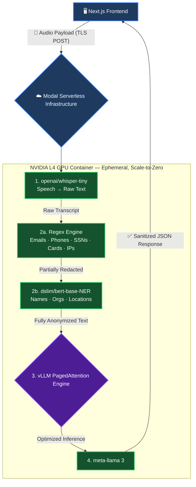

<div align="center">

<pre>
██╗    ██╗██╗  ██╗██╗███████╗██████╗ ███████╗██████╗ ██╗   ██╗ █████╗ ██╗   ██╗██╗  ████████╗
██║    ██║██║  ██║██║██╔════╝██╔══██╗██╔════╝██╔══██╗██║   ██║██╔══██╗██║   ██║██║  ╚══██╔══╝
██║ █╗ ██║███████║██║███████╗██████╔╝█████╗  ██████╔╝██║   ██║███████║██║   ██║██║     ██║
██║███╗██║██╔══██║██║╚════██║██╔═══╝ ██╔══╝  ██╔══██╗╚██╗ ██╔╝██╔══██║██║   ██║██║     ██║
╚███╔███╔╝██║  ██║██║███████║██║     ███████╗██║  ██║ ╚████╔╝ ██║  ██║╚██████╔╝███████╗██║
 ╚══╝╚══╝ ╚═╝  ╚═╝╚═╝╚══════╝╚═╝     ╚══════╝╚═╝  ╚═╝  ╚═══╝  ╚═╝  ╚═╝ ╚═════╝ ╚══════╝╚═╝
</pre>
---

[](https://github.com/vllm-project/vllm)
[](https://llama.meta.com)
[](https://huggingface.co/dslim/bert-base-NER)


</div>

---

## 📌 What Is WhisperVault?

WhisperVault is a production-grade, serverless AI pipeline that processes sensitive audio recordings with **zero data retention**. Built for enterprises, journalists, legal teams, and anyone who handles confidential conversations.

You drop in an audio file. The pipeline:

1. **Transcribes** it word-for-word using OpenAI Whisper running on an NVIDIA L4 GPU
2. **Redacts** all PII — names, phone numbers, emails, SSNs, credit cards, IP addresses, and locations — using a dual-layer regex + BERT NER engine
3. **Summarizes** the sanitized transcript using Meta's **Llama-3-8B-Instruct** served via **vLLM's PagedAttention** engine for maximum throughput
4. **Returns** a clean JSON payload and **destroys the container**

The audio file is written only to `/tmp`, deleted in a `finally` block (even on crash), and never persists beyond a single request.

---

## 🎬 Live Demo

| Step | What You See |
|---|---|
| Upload `.mp3 / .wav / .m4a` | Drag-and-drop zone with file validation |
| Click "Initialize Secure Pipeline" | Animated 6-step progress indicator with real AI stage names |
| Results load | Side-by-side raw vs. anonymized transcript with `🔒 REDACTED` inline badges |
| Executive Summary | Llama-3-8B generated, 1-2 sentence safe summary at the top |

---

## 🏗️ System Architecture




---

## 🔬 PII Redaction Engine — Deep Dive

WhisperVault uses a **5-pattern regex layer** followed by a **neural NER layer**. Together they catch virtually every form of sensitive data in spoken transcripts.

### Layer 1 — Regex (Deterministic, Instant)

| Pattern | Catches | Example |
|---|---|---|
| Email | `user@domain.com` | `john.doe@acme.com` → `[REDACTED]` |
| Phone (7-digit) | `5555-0198`, `5555–0198` | `5555-0198` → `[REDACTED]` |
| Phone (10-digit) | All US formats, international | `+1 (800) 555-0100` → `[REDACTED]` |
| Credit Card | 13–19 digit sequences | `4111 1111 1111 1111` → `[REDACTED]` |
| SSN | `XXX-XX-XXXX` | `123-45-6789` → `[REDACTED]` |
| IPv4 | `X.X.X.X` | `192.168.1.1` → `[REDACTED]` |

### Layer 2 — BERT NER (Contextual, Neural)

```
"Hi, I'm Sarah Chen calling from Acme Corp, based in Seattle."
         ↓  dslim/bert-base-NER  ↓
"Hi, I'm [REDACTED] calling from [REDACTED], based in [REDACTED]."
```

Redaction is applied **in reverse character order** so index positions stay accurate after each substitution — a common bug in naive implementations that WhisperVault explicitly handles.

---

## ⚡ Why vLLM + Llama 3?

Standard HuggingFace `pipeline()` loads model weights serially with no KV-cache optimization. For an 8B parameter model, this causes slow inference and frequent OOM crashes on a single GPU.

**vLLM solves this with PagedAttention:**

| | HuggingFace pipeline | vLLM + PagedAttention |
|---|---|---|
| KV-cache allocation | Contiguous, pre-allocated blocks | Paged (like OS virtual memory) |
| Memory fragmentation | High — wastes 60–80% of VRAM | Near-zero waste |
| Throughput | 1× baseline | 2–4× faster token generation |
| OOM risk on 8B model | Very high on T4 | Stable on L4 with `gpu_memory_utilization=0.90` |
| Temperature control | Limited | `temperature=0.0` for deterministic output |

WhisperVault uses `temperature=0.0` to ensure **deterministic, reproducible summaries** — critical for legal and compliance use cases.

---


## 🚀 Quick Start

### Prerequisites

- Python 3.10+
- Node.js 18+
- GPU access
- Hugging Face account with Llama 3

### 1. Clone the Repository

```bash
git clone https://github.com/yourusername/whispervault.git
cd whispervault
```

### 2. Authenticate with GPU

```bash
pip install[Your GPU]
```

### 3. Create the Hugging Face Secret

WhisperVault needs your HF token to download Llama 3:

```bash
modal secret create whispervault-hf-secret HF_TOKEN=hf_your_token_here
```

### 4. Deploy the Backend

```bash
modal deploy cloud.py
```

### 5. Configure the Frontend

Create a `.env.local` file in the project root:

### 6. Run the Frontend

```bash
npm install
npm run dev
```

Open [http://localhost:3000](http://localhost:3000), drag in an audio file, and click **Initialize Secure Pipeline**.


---

## ⚙️ Configuration Reference

### Backend (`cloud.py`)

| Parameter | Value | Description |
|---|---|---|
| `gpu` | `L4` | NVIDIA L4 (24 GB VRAM) — required for Llama 3 8B |
| `timeout` | `600s` | Max request duration before Modal kills the container |
| `scaledown_window` | `300s` | Idle seconds before container shuts down |
| `gpu_memory_utilization` | `0.90` | vLLM VRAM allocation (leave 10% headroom) |
| `tensor_parallel_size` | `1` | Single-GPU inference (increase for multi-GPU) |
| Whisper model | `tiny` | Swap to `base` or `small` for better accuracy |
| Llama max tokens | `150` | Controls summary length |
| Temperature | `0.0` | Deterministic output — no randomness |

### Frontend (`page.tsx`)

| Variable | Default | Description |
|---|---|---|
| `NEXT_PUBLIC_MODAL_BACKEND_URL` | `.env.local` | Your deployed Modal endpoint URL |
| Step animation interval | `2800ms` | Delay between pipeline step transitions |


---

## 📄 License

This project is licensed under the MIT License - see the [LICENSE](LICENSE) file for details. 

*Use it, fork it, ship it. The only thing you cannot do is use WhisperVault to surveil people without their knowledge. That would be spectacularly ironic.*
